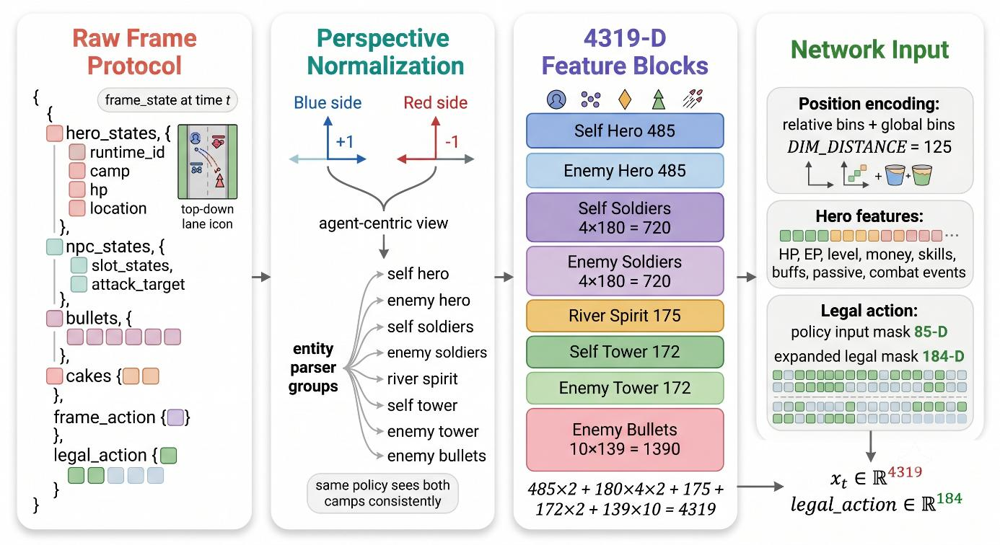
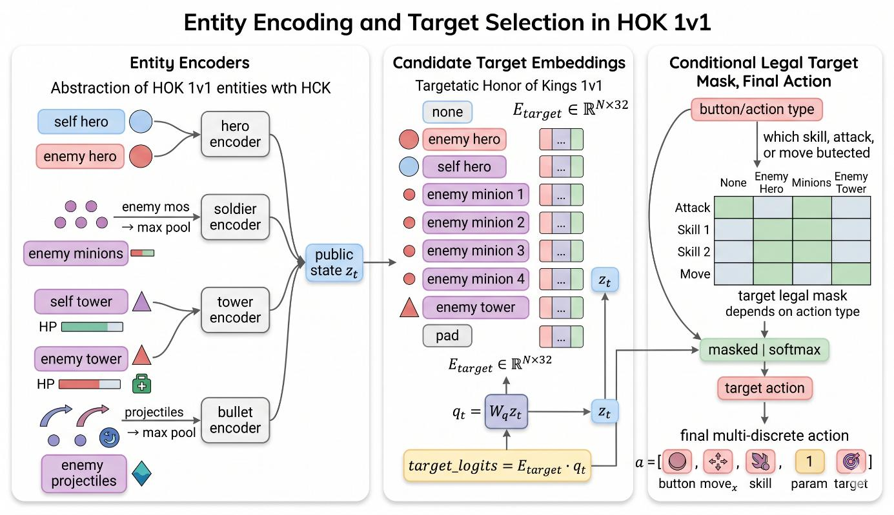
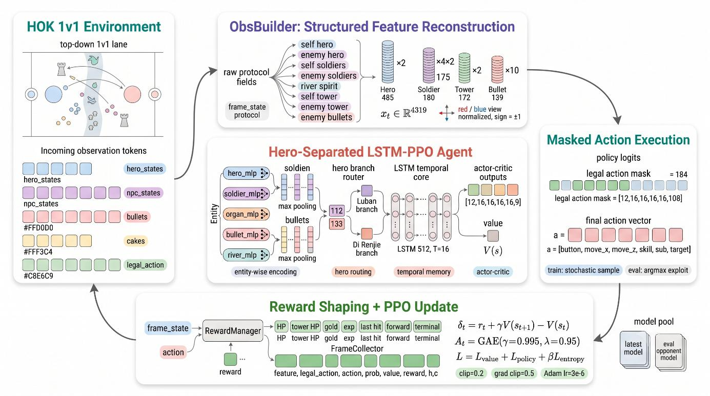
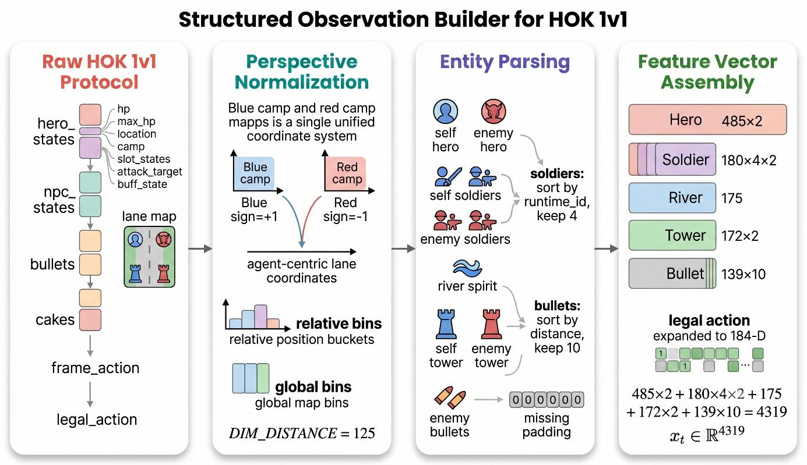
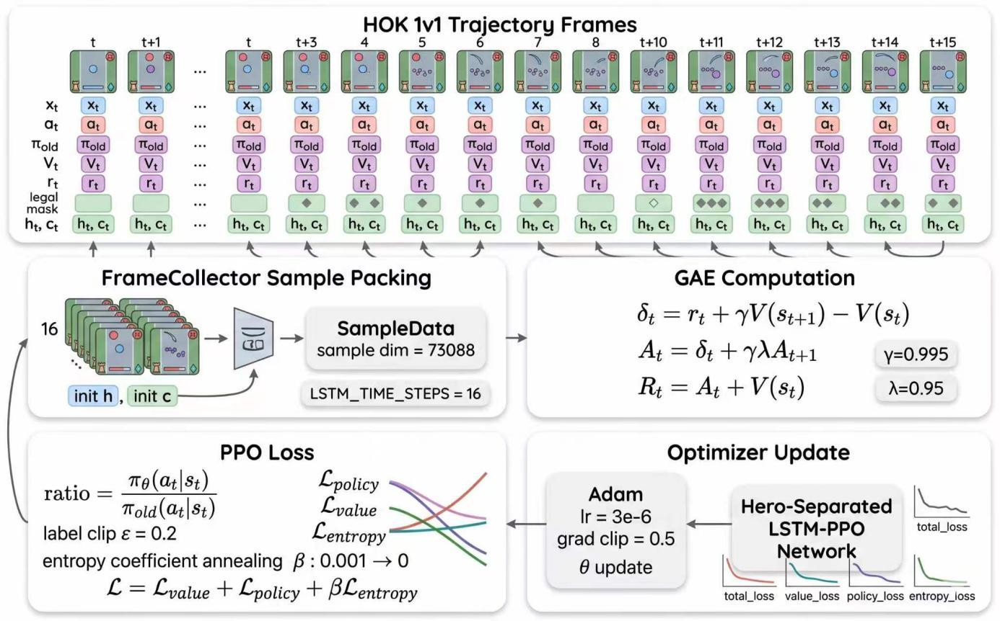
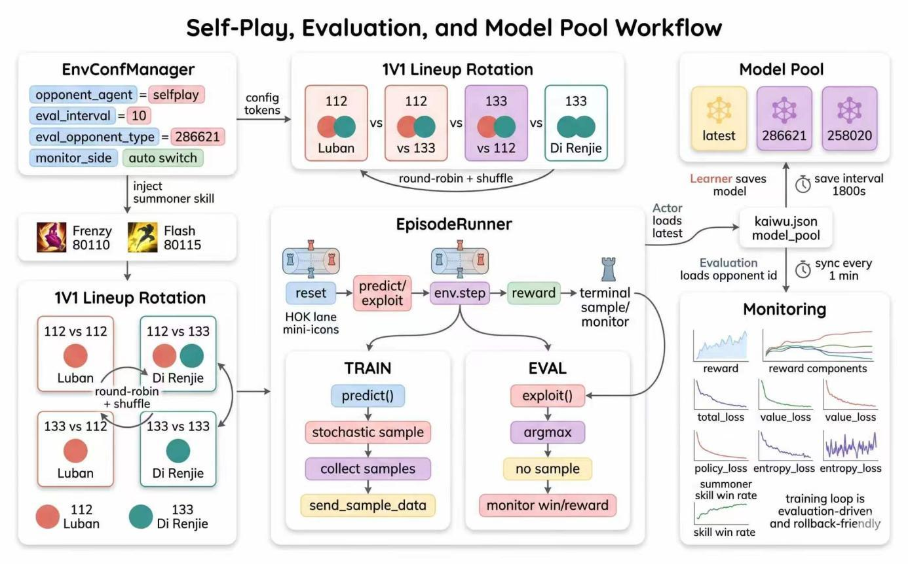
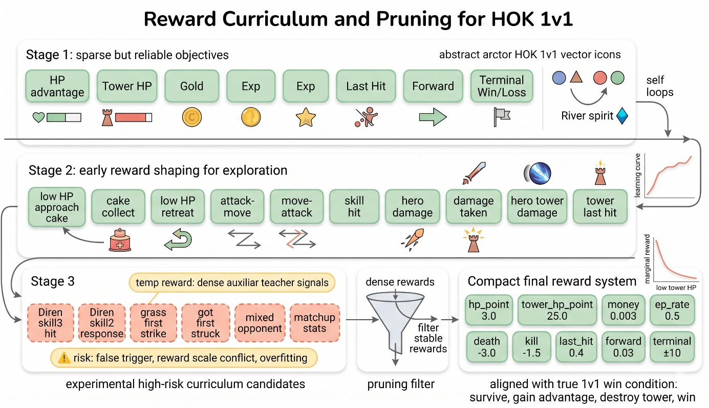
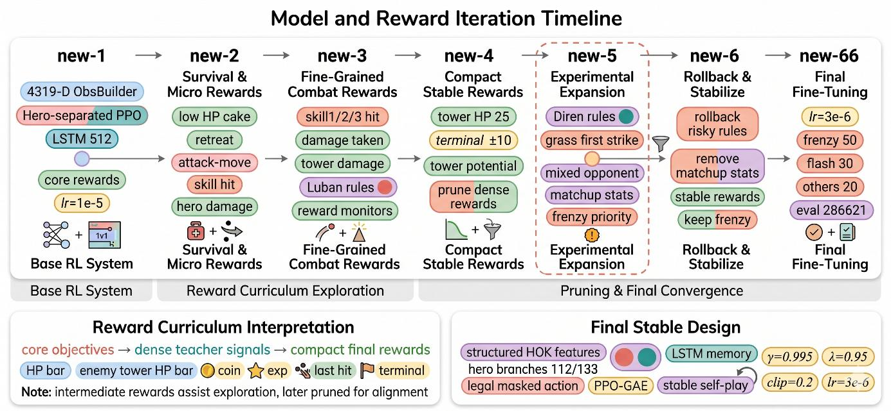
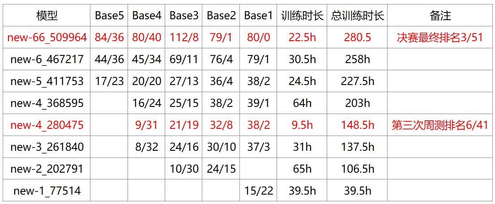

# 腾讯开悟智能体决策算法赛道

**-所想皆成111 队技术整理与分享**

## 一、简介

在2026 年4 月-2026 年6 月举办的腾讯开悟智能体决策算法比赛中，我们队伍(所想皆成111)参与了智能体追逃任务以及智能体决策挑战-1v1 任务，最终在区域赛决赛榜单中获得了第3 名的成绩。这一成绩的取得既得益于腾讯开悟提供的平台支持以及官方工作人员的帮助，也离不开我们团队本身的技术积累与通力合作。本文首先会叙述我们的参赛概况，随后从网络设计、奖励体系等关键模块出发，整理分享本队伍在开悟比赛中的探索历程与心得体会。

## 二、参赛概况

## 三、网络设计

在王者荣耀1V1 场景中，智能体需要同时处理英雄、小兵、防御塔、飞行物等多种实体信息，并根据连续对局状态完成走位、攻击、技能释放和目标选择等复杂决策。因此，我们设计了一套基于PPO 的分英雄时序决策网络，包括：实体结构化编码、分英雄策略路由、LSTM 时序建模、多头动作输出，在保证训练稳定性的同时提升模型对复杂战斗场景的表达能力。

### （一）总体强化学习系统框架

*图1 总体1V1 强化学习系统框架图*

如图1 所示，系统整体流程由特征构造、神经网络决策和PPO 训练三部分组成。

首先，游戏协议中的原始状态信息经过特征工程模块处理，被转换为统一视角下的4319 维观测向量。观测特征按照实体类型划分为英雄、小兵、防御塔、河道之灵以及飞行物等多个部分，并保留合法动作掩码信息。

随后，观测数据输入策略网络。网络首先对不同实体进行独立编码，再融合形成全局状态表示，并利用LSTM 对连续时间步信息进行建模。在得到时序特征后，策略网络输出多个动作头对应的决策结果，同时价值网络输出状态价值估计。

训练阶段采用PPO（Proximal Policy Optimization）算法，通过GAE（Generalized Advantage Estimation）计算优势函数，对策略网络和价值网络进行联合优化。推理阶段则利用合法动作掩码过滤非法动作，最终生成游戏执行动作。

这样整个系统形成了从环境交互到样本收集，再到PPO 更新和模型评估的完整强化学习流程。

### （二）实体编码与目标选择机制

*图2 实体编码与目标选择细节图*

如图2 所示，我们没有直接将4319 维输入送入单一全连接网络，而是依据MOBA 游戏的实体结构进行分组建模。

具体而言，输入状态被划分为：己方英雄（Self Hero）、敌方英雄（Enemy Hero）、己方小兵（Self Soldiers）、敌方小兵（Enemy Soldiers）、己方防御塔（Self Tower）、敌方防御塔（Enemy Tower）、河道之灵（River Spirit）、敌方飞行物（Enemy Bullets）。

每类实体首先经过独立的特征提取模块进行编码。其中位置特征采用专门的位置编码网络进行处理，实体属性特征则通过共享MLP 进行压缩表示。对于数量可变的小兵和飞行物实体，我们采用共享参数编码后再进行Max Pooling 聚合，使网络能够适应不同数量实体的动态变化，同时增强模型对实体排列顺序变化的鲁棒性。

在动作决策阶段，我们进一步引入目标Embedding 机制实现目标选择。传统方法通常将目标选择视为固定类别分类问题，而本方案首先对所有候选目标生成低维嵌入向量，再将当前状态表示映射为查询向量，通过向量匹配计算目标得分。

这种设计使模型能够依据目标当前状态动态决定攻击对象。例如敌方英雄残血、敌方防御塔血量较低或兵线进入塔下时，目标选择头能够自动调整输出偏好，从而提升复杂战斗场景下的决策能力。

### （三）分英雄LSTM-PPO 网络架构

如图3 所示，我们采用分英雄LSTM-PPO 网络作为最终决策模型。

*图3 模型架构图：分英雄LSTM-PPO 网络*

首先，各类实体编码结果经过拼接融合形成全局状态表示。为了充分利用战斗过程中的时序信息，融合后的特征输入单层LSTM 网络进行序列建模。训练阶段采用16 帧时间窗口构建序列样本，推理阶段继承上一时刻的隐藏状态，从而保留技能释放、走位变化以及战斗节奏等历史信息。

在策略层设计上，我们针对不同英雄建立独立的策略分支。比赛过程中主要使用鲁班七号和狄仁杰两名英雄，两者在攻击距离、技能机制和战斗风格方面存在明显差异。若完全共享同一套策略参数，容易产生策略冲突。因此我们采用共享特征提取以及英雄策略分支的设计：底层实体编码模块共享参数、每个英雄维护独立策略网络参数、根据英雄ID 自动完成策略路由。这种结构既能够共享环境认知能力，又能够学习针对不同英雄的专属战斗策略。

在动作输出部分，网络采用多头动作结构，将复杂动作空间拆分为多个离散决策子任务，包括移动方向、技能选择、攻击行为以及目标选择等。其中前几个动作头直接输出动作概率分布，目标选择头则结合目标Embedding 进行计算。所有动作头均结合合法动作Mask 进行约束，从而保证策略输出始终满足游戏规则要求。

最终，该网络通过实体结构化表示、时序建模、分英雄策略决策以及多头动作输出，在比赛训练过程中表现出良好的稳定性和泛化能力。

## 四、奖励体系

### （一）奖励设计思路

比赛初期，我们尝试通过增加大量行为奖励来引导智能体学习具体战术动作，例如技能命中、低血量撤退、血包获取、走位拉扯等。然而在自博弈训练过程中发现，过于复杂的奖励结构容易导致不同奖励项之间产生竞争关系，使模型过度关注局部收益，而忽略推塔和胜负等核心目标。

因此，在后续迭代中，我们逐渐将奖励体系收敛到少量关键目标上，重点围绕英雄生存、经济成长、防御塔推进以及最终胜负构建奖励信号。同时采用零和差分机制衡量双方相对优势，使奖励能够更准确地反映真实对抗结果，提高训练稳定性和策略泛化能力。最终形成了以血量优势、防御塔优势、经济经验优势、补刀收益和终局胜负为主体的奖励体系。

### （二）零和差分奖励机制

为了增强奖励信号与对抗结果之间的关联性，我们采用零和差分思想构建大部分奖励项。

传统奖励通常仅关注己方状态变化，例如血量增加、经济增长等。然而在MOBA 对抗环境中，策略优劣更多体现在双方相对优势，而非单边数值变化。因此，我们将奖励定义为双方状态差值在相邻时刻的变化量：“当前己方优势−上一时刻己方优势”。通过这种方式，己方获得优势时产生正奖励，对方获得优势时产生负奖励，从而形成天然的零和博弈结构。

该机制被应用于英雄血量、防御塔血量、经济、经验等多个关键指标，使模型能够学习如何持续扩大相对优势，而非单纯追求自身数值增长。

### （三）核心奖励设计

#### 1. 英雄血量奖励

英雄血量奖励用于衡量双方换血收益与生存状态。

考虑到残血阶段往往决定团战结果和对局胜负，我们没有直接使用线性血量比例，而采用非线性势函数对血量进行映射，使低血量区域的变化更加敏感。这一设计能够放大残血状态下的收益和风险，引导智能体在优势时积极压制对手，在劣势时主动规避风险，从而学习更加合理的换血策略与生存行为。

#### 2. 防御塔奖励

防御塔是1V1 模式中的核心胜负目标，因此我们给予其最高权重。

为了进一步强化推塔意识，我们设计了分段式塔血势函数。随着防御塔血量不断下降，其奖励增益逐渐提高。当敌方防御塔进入低血量阶段时，模型能够获得更加密集的正向反馈；反之，己方防御塔残血受到攻击时，也会产生更强烈的负反馈。这种设计使策略能够更加关注关键推塔时机，并主动保护己方防御塔，与游戏最终胜利目标保持一致。

#### 3. 经济与经验奖励

经济和经验奖励用于鼓励智能体获取持续成长优势。

相比于击杀和推塔等相对稀疏的事件，经济和经验能够持续反映对局节奏，因此我们将其作为辅助奖励引入体系。通过鼓励经济领先和等级领先，模型能够更快建立装备与属性优势，从而提高中后期战斗能力。

#### 4. 补刀奖励

补刀是前期经济获取的重要来源，也是高水平玩家的重要基本功。

为了帮助模型更早建立兵线运营意识，我们增加了补刀奖励。当智能体成功完成小兵最后一击时获得正向反馈，而敌方完成补刀则产生相应负向反馈。该奖励有效缓解了训练初期经济收益稀疏的问题，使模型能够在尚未具备稳定击杀能力时，通过补刀行为获得持续学习信号。

#### 5. 推进奖励

在训练早期阶段，智能体容易出现长时间原地徘徊或过度保守的问题。为此，我们设计了有限时间窗口内的推进奖励，鼓励模型在健康状态下主动向敌方防御塔方向移动，从而提升探索效率和进攻意愿。当训练进入中后期后，该奖励自动关闭，避免模型为了获取推进收益而忽视兵线、防御塔或战斗收益等更重要目标。

#### 6. 终局胜负奖励

为了强化策略与最终任务目标之间的联系，我们引入显式终局奖励。

对局胜利时给予较大正奖励，失败时给予对应负奖励，非正常结束则不额外计算终局收益。该奖励不仅参与策略更新，同时用于价值函数训练，使模型能够更准确地建立长期行为与最终胜负之间的因果关联。

### （四）奖励体系迭代过程

在早期版本中，我们尝试引入大量细节引导奖励，包括技能命中、低血量撤退、血包获取、走A 操作、承伤控制、草丛先手、技能响应等奖励。这些奖励能够在训练初期提供丰富学习信号，帮助模型快速掌握基础操作和局部战术。

然而随着训练深入，我们发现过多的行为奖励容易产生奖励竞争问题，导致策略偏离真实胜负目标。例如模型可能为了获取局部奖励而执行非最优决策，甚至出现奖励投机行为。

因此，在后续版本中，我们逐步裁剪复杂规则，仅保留与最终目标最相关的奖励项，将训练重点重新聚焦于血量优势、防御塔优势、经济成长、补刀收益以及终局胜负等关键指标。

从强化学习视角来看，这一过程实际上构成了一种奖励课程学习机制。训练初期利用密集奖励降低探索难度，引导模型掌握基础行为；训练后期逐步减少人工规则约束，使策略回归真实胜负目标。最终形成的奖励体系结构更加紧凑，在训练稳定性、自博弈收敛速度以及最终评估表现方面均取得了更好的效果。

## 五、特征与规则

特征与规则是我们智能体系统感知环境和决策的基础。与直接使用原始协议字段不同，我们设计了专门的观测构造器（ObsBuilder），将游戏环境输出的、结构相对扁平的协议数据，重新组织并编码为语义清晰、视角统一、长度固定的特征向量。这种结构化的预处理对于提升模型的决策效率和效果至关重要。

*图4 观测特征构造图：从王者荣耀协议到4319 维输入*

我们的观测构造流程（如图4 所示）遵循以下核心原则，最终输出一个维度为4319 的统一观测向量，作为智能体神经网络模型的输入。

#### 1. 视角统一处理

在MOBA 1v1 对局中，红蓝双方的地图呈镜像对称。为了简化模型的学习难度，避免模型需要分别学习“在左下方”和“在右上方”的两套策略，我们进行了视角统一。在特征构造阶段，我们将所有位置坐标通过一个符号因子（蓝方为1，红方为-1）进行转换，使得模型始终认为“己方基地在下路”，所有实体位置都基于此统一的己方视角进行表达。这极大地提高了样本的利用率和学习效率。

#### 2. 位置编码设计

位置信息是决策的关键。我们的位置编码由两部分复合而成，总维度为125 维：

相对位置：以己方英雄为中心，计算目标实体在X 和Z 方向上的偏移距离，并进行分桶编码。这部分特征直观地表达了“目标在我哪个方向、离我多远”。

全局位置：将整个地图的坐标轴进行分桶，编码目标实体所在的绝对地图区域。这部分特征帮助模型理解“目标处于地图的哪一段”，例如是在河道、线上还是塔下。

结合相对与全局位置信息，模型能够同时感知局部走位关系和全局战略位置。

#### 3. 英雄特征构建

单个英雄的特征维度为485 维，全面刻画了其在1v1 对局中的核心状态，包括：

身份与状态：英雄ID、行为模式（移动、攻击、施法等）、生命值（HP）、能量值（EP）、等级、总经济与经济增量。

技能系统：普攻及1/2/3 技能、召唤师技能的详细状态，包括可用性、等级、冷却时间比例、累计使用次数、对英雄命中次数、当前帧是否释放、以及连招效果剩余时间等。

战斗与交互：携带的增益效果（Buff）、被动技能状态、当前帧对英雄造成的伤害、命中的目标数量、与防御塔的关系（是否在敌方/己方塔攻击范围内、是否被塔锁定）。

基础属性：攻击距离、击杀收益、视野范围、物理/法术攻击力、物理/法术防御、移动速度、攻击速度等。

#### 4. 其他实体特征

小兵：最多处理己方和敌方各4 个小兵，每个小兵180 维特征，包括其兵种、行为、血量、与塔的关系及位置信息。多个小兵通过Max Pooling 聚合，增强模型对数量动态变化的鲁棒性。

防御塔/机关：包含其攻击目标类型、血包刷新状态、机关子类型、单位属性及位置等信息。

河道之灵：作为重要的中立资源，拥有独立的特征编码。

飞行物：主要用于识别和规避敌方技能与防御塔攻击。我们优先处理对己方英雄威胁最大的敌方飞行物，并区分其来源（英雄、小兵、防御塔）。

#### 5. 召唤师技能与动作规则

召唤师技能策略：在训练时，我们为鲁班七号和狄仁杰按加权概率采样召唤师技能，其中“狂暴”技能权重最高，以引导模型学习主流打法，同时保留“闪现”等技能的少量探索以维持策略鲁棒性。在评估和最终提交时，则固定使用“狂暴”技能，以确保策略的确定性。

动作后处理与合法性：智能体的动作输出需经过严格的合法性校验。我们通过legal action mask 机制，在推理时对神经网络输出的非法动作施加极大的负偏置，确保最终采样的动作均为游戏引擎可执行的有效动作。对于“目标选择”这类依赖前序动作类型的子动作，我们实施了条件掩码，进一步保证动作组合的合法性。

## 六、强化学习算法

在本项目中，我们采用近端策略优化（Proximal Policy Optimization, PPO）算法作为强化学习训练的核心框架，并结合广义优势估计（Generalized Advantage Estimation, GAE）与长短期记忆网络（LSTM）来处理智能体决策中的信用分配与部分可观测性问题。整个算法设计旨在实现稳定、高效的政策梯度更新，并使智能体能够学习具有记忆和策略性的复杂行为。

我们选择PPO 算法主要基于其在复杂高维动作空间中的训练稳定性与样本效率。PPO 通过引入裁剪（Clipping）的目标函数，有效地约束了每次迭代中策略更新的幅度，防止因单次不良更新导致策略性能崩溃，这对于《王者荣耀》1v1 这种动态、高风险的对抗环境至关重要。

为应对游戏环境的部分可观测性和决策的长时序依赖性，我们在策略网络和价值网络中集成了LSTM 层。LSTM 使智能体能够维护一个内部隐藏状态，从而基于历史观测序列进行决策，而非仅依赖当前单帧信息。

*图5 PPO-GAE 训练与LSTM 样本构造图*

如图5 所示，我们的训练样本构造专门为LSTM 进行了优化：

序列采样：在从经验回放缓冲区采样时，我们并非抽取独立的经验转换，而是抽取固定长度的连续轨迹序列。这保证了LSTM 能够处理具有时间上下文关联的样本。

隐藏状态管理：在训练过程中，LSTM 的初始隐藏状态在序列开始时被重置或从前一序列的最终状态继承。在计算每个时间步的损失时，我们需要考虑LSTM 隐藏状态的流动，以确保梯度沿时间步正确传播。

优势与回报计算：GAE 和折扣回报的计算是在整个采样的轨迹序列上完成的，这为LSTM 提供了连贯的时序信号，使其能够学习到动作的长期后果。

## 七、系统工程架构

我们在官方基础代码与架构上进行修改，得到了一套包含自博弈（Self-Play）、模型池（Model Pool）与自动化评估（Evaluation）的完整工程流水线，整体架构与工作流程如图6所示。

*图6 自博弈、评估与模型池工程流程图*

自博弈是我们训练数据的核心来源。其核心思想是让智能体与自己进行对抗，从而自动生成无需人工标注的博弈数据。通过控制模型池中对手策略的组成，我们为“学习者”提供了难度渐进、风格多样的对抗环境。这有效避免了策略陷入局部最优，促进了更通用的策略的生成。

为了客观、持续地追踪模型性能，避免训练指标与真实博弈能力脱节，我们建立了一套独立的自动化评估系统。我们固定一组具有代表性的评估对手，评估对手来自从模型池中挑选的几个关键历史版本。在训练过程中，系统会定期暂停自博弈数据收集，将当前的“学习者”模型切换到评估模式。在评估模式下，“学习者”会与评估对手集中的每一个对手进行多场对局，以统计其胜率、平均获胜时长、平均经济差等核心指标。

## 八、模型迭代过程

我们最终模型的实现经历了一个循序渐进的迭代优化过程。整个迭代周期主要是奖励函数的演变，网络结构、特征工程与PPO 算法主体则始终保持稳定。这一过程深刻体现了课程学习（Reward Curriculum Learning）的思想：在训练的不同阶段，通过调整奖励信号的密度与导向，引导智能体从学习基础行为逐步进化到掌握高级博弈策略。如图7 和图8 所示，我们的迭代整体分为三个阶段：1）搭建基础训练模型；2）引入密集奖励以塑造具体行为；3）裁剪奖励、回归核心目标以实现稳定收敛。

*图7 奖励课程学习与裁剪过程*

*图8 模型与奖励迭代时间轴图*

#### 1. 第一阶段：基础闭环建立（版本1）

new1 完成了从原始协议到智能体决策的搭建。我们构建了4319 维的观测特征、分英雄路由的网络架构以及PPO+GAE+LSTM 的训练框架。初始奖励函数聚焦于几个核心的零和差分指标：血量差、防御塔血量差、经济经验差、补刀与终局胜负。此阶段的目标是验证整套系统能否在自博弈环境下启动并产生基本的学习信号，为后续迭代打下坚实的基础。

#### 2. 第二阶段：密集奖励塑造行为（版本2、3）

在基础闭环运行稳定后，我们进入了奖励塑造阶段，旨在为智能体提供更细节、更密集的学习信号，以克服从稀疏的胜负奖励中直接学习高级战术的困难。

new2：引入了大量与生存、续航和基础操作相关的奖励，如“低血量靠近血包”、“使用血包”、“低血量危险惩罚/安全撤退”以及“走A”奖励。同时，增加了“技能命中英雄”和“英雄伤害”奖励，鼓励积极的换血与进攻。这些奖励帮助智能体在学会“推塔获胜”这个终极目标前，先掌握“保持健康”、“有效回血”、“高效普攻”和“释放技能”等子技能。

new3：对奖励进行了更精细的建模。将技能命中奖励按技能槽拆分，新增“承伤惩罚”、“对塔伤害”、“最后一击推塔”奖励，并针对特定英雄（鲁班七号）设计了技能释放奖励。此版本致力于让智能体理解不同技能的收益、防御塔的战略价值以及特定英雄的连招机制。

#### 3. 第三阶段：奖励裁剪与核心目标收敛（版本4、6、66）

在通过密集奖励引导智能体掌握了基本行为后，我们进入了奖励“裁剪”或“退火”阶段。如图7所示，此阶段的目标是逐步移除那些可能干扰最终目标、引入噪声或导致策略偏置的中间奖励，让智能体的目标重新与“推塔获胜”这一终极且稀疏的奖励对齐

版本4：是一次关键的回滚与强化。我们移除了版本2、3 中加入的大部分行为塑造奖励，回归到类似版本1但更加强化的核心奖励集。显著提升了“防御塔血量”和“终局胜负”的奖励权重，并引入了“塔血分段势函数”，使得在塔血较低时，单位血量变化能产生更高的奖励信号，强烈鼓励完成推塔。

new5：作为一个高风险、高探索性的实验分支，尝试了更具战术针对性的规则。例如，增加了“草丛先手/被先手”奖励以利用视野机制，为狄仁杰设计了“三技能命中”与“被敌方三技能命中后使用二技能响应”的专项奖励。此版本还尝试了混合历史模型对手的训练策略，以增加训练数据的多样性。

版本6：明确回滚了版本5 中大部分高风险的英雄专项和草丛规则，只保留了其关于“召唤师技能以狂暴为主”的策略方向。这确认了在自博弈训练中，过于复杂和特定的奖励项可能引发训练不稳定，而简洁、通用的核心奖励配合强大的值函数近似能力，是更可靠的路径。

版本66（最终版）：进行了最后的精细调优。将学习率从1e-5 降低至3e-6，以适应模型后期收敛阶段对稳定性的更高要求。同时，进一步优化了召唤师技能在训练阶段的采样分布，大幅提高“狂暴”技能的权重，使其在训练中占据主导，与评估阶段固定使用“狂暴”的策略保持一致，仅保留少量其他技能以维持策略的鲁棒性。

## 九、训练效果分析

*图9 各版本模型训练时长与效果图*

如图9 列出了各版本模型的训练时长与累计训练时长，以及各模型分别与官方提供的base代码的对战结果。

#### 1. 关键迭代的开销与收益分析

图9 清晰地记录了从new-1 到new-66 共7 个主要版本的训练开销与评估收益，结合迭代过程，可以证明奖励课程学习的有效性。

我们的迭代路径从基础模型到密集奖励塑造再到奖励裁剪收敛，带来了模型能力的实质性提升。初期模型new-1 仅能战胜最弱的Base1。在引入密集奖励进行行为塑造后（new-2, new-3），模型开始能够战胜Base2 和Base3，表明其学会了补刀、换血、技能释放等基础操作。然而，new-3 对更强的Base4 胜率（8/32）仍不理想，说明复杂的奖励项可能引入了干扰。在关键的奖励裁剪阶段（new-4），模型性能实现了第一次飞跃，对Base4 的胜率大幅提升至16/24，这表明回归核心、目标明确的奖励函数更能驱动策略专注于最终胜利，训练更稳定高效。后续版本在new-4 的基础上进行微调，胜率得到进一步巩固和提升，最终模型new-66 对Base4 和Base5 取得了约70%的高胜率，并在西部区域赛决赛最终榜中排名3/51。

#### 2. 最终提交模型能力总结

我们最终提交的决赛模型为new-66_509964。该模型累计训练时长为280.5 小时，其单版本训练时长为22.5 小时。

根据其评估结果，我们可以发现其强大的对抗能力。该模型对阵官方提供的、强度递增的5个基线模型（Base1 至Base5），取得了压倒性的胜率（对Base5 为84/36，胜率70%），展现出卓越的综合竞技水平。

同时，模型还体现出高度的策略鲁棒性，模型不依赖于针对特定对手的“小技巧”，而是通过专注于“建立并扩大血量、经济、塔防等核心优势”的通用策略来赢得比赛。这使其能稳定应对不同战术风格的对手。

该模型是我们“奖励课程学习”思路的最终产物。它证明了在MOBA 1v1 场景下，一个经过精心裁剪、以零和差分和终局胜负为核心的简洁奖励函数，配合PPO+LSTM 框架，能够驱动智能体高效地学习到超越复杂规则集的、以胜利为终极目标的策略。模型在决赛中取得第3 名的成绩，是对其有效性的最终验证。

## 十、工作亮点、创新性及实用性

#### 1. 核心创新与亮点

我们的工作亮点主要体现在课程奖励设计、网络架构创新和高效特征处理上：

在奖励设计上，我们没有采用复杂、固定的奖励函数堆砌，而是实践了一套动态的奖励课程学习方法。再加快收敛速度的同时，有效避免了奖励干扰，最终形成了简洁、高效且目标明确的奖励体系，是模型取得高性能的关键。

网络结构上，针对比赛使用的鲁班七号与狄仁杰两名机制迥异的英雄，我们采用了共享底层编码、分英雄策略分支的网络架构，在共享特征编码的同时，允许模型学习针对不同英雄技能和战斗风格的特化策略，显著降低了多英雄策略冲突，提升了训练效率与最终性能。

在特征处理上，我们没有将协议提供的扁平化向量直接输入网络，而是将其重建为英雄、小兵、防御塔等语义明确的实体，并对同类可变数量实体（如小兵）进行共享编码。这种结构化表示更贴合游戏世界的真实构成，增强了模型的泛化与鲁棒性。此外，我们将“选择攻击目标”这一动作从固定类别分类，改进为基于“目标Embedding”与当前状态查询向量的动态匹配机制，使目标选择能依据战况灵活变化，决策更为合理。

#### 2. 实用性及迁移价值

本方案中采用的方法具有较强的通用性，可为解决类似的复杂序列决策问题提供实践参考，“结构化实体编码+注意力”的处理范式，可直接迁移至任何包含多个、可变数量智能体或对象的场景，如即时战略游戏（RTS）、多智能体协同、机器人环境感知等。

同时，“围绕终极目标设计少量核心奖励，谨慎使用中间奖励进行课程引导”的原则，适用于大多数奖励稀疏的强化学习任务，能有效提升训练稳定性。

## 十一、总结与展望

在本次腾讯开悟1v1 赛道中，我们团队从零开始，构建并迭代了一套完整的强化学习智能体解决方案。该方案以PPO+GAE+LSTM 为算法主干，通过分英雄路由网络处理多英雄策略差异，利用结构化实体编码与动态目标选择提升状态感知与决策质量，并依托自博弈与模型池工程实现高效训练。尤为关键的是，我们通过奖励课程学习与裁剪的实践，最终收敛到一个以零和差分和终局胜负为核心的简洁而强大的奖励函数上，驱动模型学会了以扩大优势、推塔获胜为核心的高水平竞技策略。最终模型在官方5 个强度递增的基线模型上均取得高胜率，并在区域决赛中获得第三名，验证了整套技术路线的有效性。

受限于比赛周期与算力，仍有若干有价值的探索方向未能深入，后续工作可围绕以下方面展开：

1. 更智能的对手采样与课程生成：当前自博弈的对手从模型池中均匀或按简单规则采样。未来可引入基于策略空间度量或Elo 评分的自适应对手采样机制，实现更有针对性的课程训练，进一步提升策略的强度。

2. 探索更长期依赖的决策：当前LSTM 主要建模短期战斗节奏（如连招、走A）。对于1v1全局层面的兵线运营、技能交换周期、召唤师技能博弈等更长周期的策略，可尝试引入具有更强长序列建模能力的架构。

总的来说，本次参赛为我们提供了宝贵的工程实践机会，验证了强化学习在复杂游戏环境中解决决策问题的巨大潜力。我们相信，相关的方法论与工程经验，对推动智能决策技术在更广泛领域的应用具有积极的参考价值。

## 参考文献

1. Sullivan, R., Kumar, A., Huang, S., Dickerson, J. P., & Suarez, J. (2023). Reward scale robustness for proximal policy optimization via DreamerV3 tricks. Advances in Neural Information Processing Systems, 36.

2. Ye, D., Liu, Z., Sun, M., et al. (2020). Mastering complex control in MOBA games with deep reinforcement learning. Proceedings of the AAAI Conference on Artificial Intelligence, 34(04), 6672-6679.
